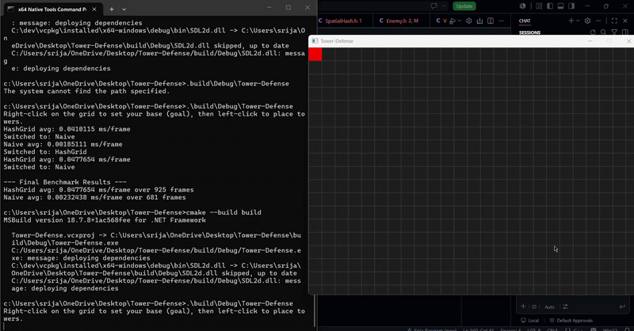

# 2D Tower Defense Game Engine

## Overview

This project is a fully custom 2D tower defense game engine built from scratch in C++17 — no game engine frameworks used. Enemies pathfind toward a player-defined base using BFS over a grid graph, routing dynamically around placed towers. Collision detection uses a spatial hash grid for O(1) average lookup, with a live in-game toggle (press B) that switches between naive O(N²) and optimized collision, displaying real measured frame-time differences on exit.

Built entirely from scratch with no game engine frameworks — just C++17, SDL2, and custom implementations of every system.

---

## Demo



---

## Concepts involved

### Spatial Hash Grid (Collision)
Divides the world into fixed-size cells. Each entity is inserted into its corresponding cell every frame. Collision queries only check the entity's cell and its 8 neighbors — reducing worst-case checks from O(N²) to O(1) average per entity.


### BFS Pathfinding
The game world is a grid graph — each walkable cell is a node, edges connect 4-directional neighbors. BFS finds the shortest unweighted path from enemy spawn to the base.

**Path invalidation:** when a tower is placed, its cell is marked blocked and BFS reruns from the enemy's current position.

---

## Project Structure

```
TowerDefense/
├── src/
│   └── main.cpp
├── Demo/
│   └──Demo_video.gif 
├── include/
│   ├── Vec2.h          # 2D vector with operators
│   ├── Entity.h        # Abstract base class
│   ├── Enemy.h         # Enemy subclass with BFS path following
│   ├── Tower.h         # Tower subclass
│   ├── Grid.h          # 2D walkable/blocked cell map
│   ├── SpatialHash.h   # Hash grid collision system
│   └── Pathfinding.h   # BFS implementation
├── CMakeLists.txt
└── .gitignore
```

---

## Installation

### Windows

**Prerequisites:** Visual Studio 2022 (Desktop development with C++ workload + Windows 11 SDK), CMake 3.15+, vcpkg

**1. Clone vcpkg and install SDL2:**
```bash
git clone https://github.com/microsoft/vcpkg.git C:/dev/vcpkg
cd C:/dev/vcpkg
bootstrap-vcpkg.bat
vcpkg install sdl2:x64-windows
```

**2. Clone this repo:**
```bash
git clone https://github.com/srijaaa22/Tower-Defense.git
cd Tower-Defense
```

**3. Build (from x64 Native Tools Command Prompt):**
```bash
cmake -B build -S . -DCMAKE_TOOLCHAIN_FILE=C:/dev/vcpkg/scripts/buildsystems/vcpkg.cmake
cmake --build build
```

**4. Run:**
```bash
.\build\Debug\TowerDefense.exe
```

---

### macOS

**Prerequisites:** Xcode Command Line Tools, Homebrew, CMake, SDL2

**1. Install dependencies:**
```bash
xcode-select --install
brew install cmake sdl2
```

**2. Clone this repo:**
```bash
git clone https://github.com/srijaaa22/Tower-Defense.git
cd Tower-Defense
```

**3. Build:**
```bash
cmake -B build -S .
cmake --build build
```

**4. Run:**
```bash
./build/TowerDefense
```

---

### Linux (Ubuntu/Debian)

**Prerequisites:** GCC/Clang, CMake, SDL2

**1. Install dependencies:**
```bash
sudo apt update
sudo apt install build-essential cmake libsdl2-dev
```

**2. Clone this repo:**
```bash
git clone https://github.com/srijaaa22/Tower-Defense.git
cd Tower-Defense
```

**3. Build:**
```bash
cmake -B build -S .
cmake --build build
```

**4. Run:**
```bash
./build/TowerDefense
```

---

## Usage

| Input | Action |
|---|---|
| Right-click | Set base (goal) location — teal cell |
| Left-click | Place a tower — enemy reroutes instantly |
| B | Toggle between Naive O(N²) and Hash Grid collision |
| Close window | Exit — prints final benchmark summary |

---

## Architecture

```
handleInput() → update(dt) → render()
     ↓               ↓
SDL events      Fixed timestep
                (16.67ms steps)
                     ↓
              SpatialHash::rebuild()
              BFS::pathfind()
              Enemy::update()
```

---

## License
MIT License
