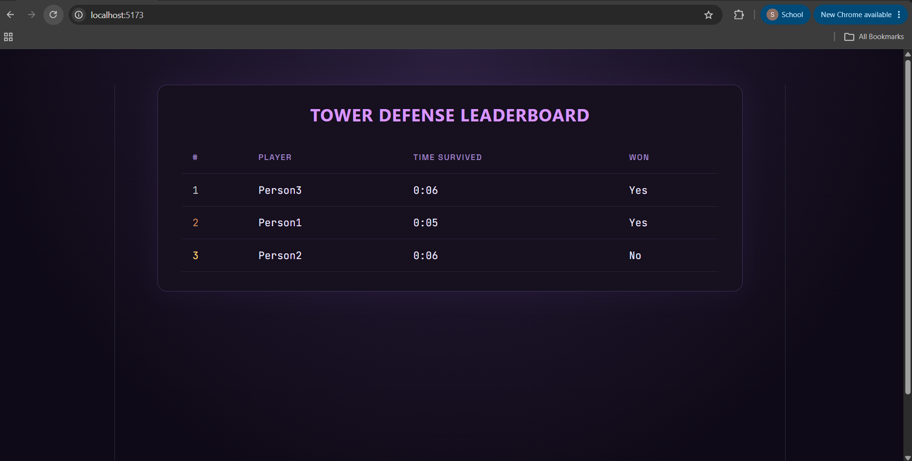
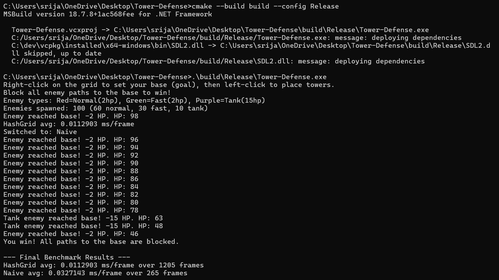

# Tower Defense

## Overview

This project is a custom 2D tower defense game built from scratch in C++17, using SDL2 for rendering and input, plus a small FastAPI leaderboard backend and a Vite + React frontend for local score tracking.

The gameplay revolves around placing towers to block enemy routes, rerouting enemies with BFS pathfinding, and evaluating collision performance between a naive O(N²) approach and a spatial hash grid. The project includes a full local leaderboard flow so scores can be submitted from the game and displayed in a browser.

The repository combines three parts:
- C++ game engine and gameplay systems
- Python API for storing scores in SQLite
- React website for viewing the leaderboard

---

## Demo

### Gameplay video


### Leaderboard preview



### Terminal build/run screenshot



---

## Core gameplay systems

### Pathfinding with BFS
The game uses a grid graph where each walkable cell is a node, and enemies move toward the base using shortest-path BFS. When a tower is placed, the blocked cell is marked in the walkable grid and the path is recalculated immediately so enemies reroute dynamically.

### Spatial hash collision optimization
Each entity is inserted into a fixed-size grid cell, and collision checks only happen in the current cell and neighboring cells. This reduces the heavy pairwise checks of a naive approach and provides a measurable performance difference during runtime.

### Benchmark toggle
Press B in-game to switch between:
- Naive collision mode
- Spatial hash collision mode

On exit, the game prints final statistics comparing average frame time.

---

## Project structure

```text
Tower-Defense/
├── CMakeLists.txt                # C++ project build config
├── LICENSE                       # MIT license
├── README.md                     # Project documentation
├── bench.csv                     # Benchmark history output
├── stats.json                    # Game stats snapshot
├── .gitignore
├── src/
│   └── main.cpp                  # Main game loop and gameplay logic
├── include/
│   ├── Enemy.h                   # Enemy types and movement logic
│   ├── Entity.h                  # Base entity model
│   ├── Fast_Enemy.h              # Faster enemy variant
│   ├── Grid.h                    # Grid/blocking logic
│   ├── Pathfinding.h             # BFS pathfinding logic
│   ├── SpatialHash.h             # Spatial hash collision system
│   ├── Tank_Enemy.h              # Tank enemy variant
│   ├── Tower.h                   # Tower logic
│   └── Vec2.h                    # 2D vector utilities
├── backend/
│   ├── analytics.py              # Score/benchmark visualization helper
│   ├── main.py                   # FastAPI leaderboard backend
│   └── submit.py                 # Score submission script
├── frontend/
│   ├── package.json              # React/Vite app configuration
│   ├── vite.config.js            # Vite config
│   ├── eslint.config.js          # Lint configuration
│   ├── index.html                # App root HTML
│   ├── public/                   # Static files
│   └── src/
│       ├── App.css               # Leaderboard styling
│       ├── App.jsx               # Leaderboard UI
│       ├── index.css             # Global CSS
│       ├── main.jsx              # React entry point
│       └── assets/               # Static UI assets
└── Demo/                         # Documentation elements
```

---

## Controls

| Input | Action |
|---|---|
| Right-click | Set the base / goal location |
| Left-click | Place a tower |
| B | Toggle collision mode between naive and spatial hash |
| Close window | Exit and print benchmark results |

---

## Setup and installation

### 1) Install prerequisites

#### Windows (recommended)

Install the following first:
- Visual Studio 2022 with Desktop development with C++
- Windows 11 SDK
- CMake 3.15+
- Git
- Node.js 18+
- Python 3.10+

Then install SDL2 through vcpkg:

```powershell
git clone https://github.com/microsoft/vcpkg.git C:/dev/vcpkg
cd C:/dev/vcpkg
bootstrap-vcpkg.bat
vcpkg install sdl2:x64-windows
```

#### macOS

```bash
xcode-select --install
brew install cmake git node python3 sdl2
```

#### Ubuntu / Debian

```bash
sudo apt update
sudo apt install build-essential cmake git python3 python3-venv nodejs npm libsdl2-dev
```

---

### 2) Clone the repository

```bash
git clone https://github.com/srijaaa22/Tower-Defense.git
cd Tower-Defense
```

---

### 3) Create and activate the Python virtual environment

From the project root, go into the backend folder and create a virtual environment.

If on Windows PowerShell:

```powershell
cd backend
python -m venv venv
venv\Scripts\activate
```

If on macOS/Linux:

```bash
cd backend
python3 -m venv venv
source venv/bin/activate
```

Install the Python dependencies used by the leaderboard API and analytics helper:

```bash
pip install fastapi uvicorn pydantic pandas matplotlib
```

---

### 4) Install frontend dependencies

From the project root:

```bash
cd frontend
npm install
```

This installs React and Vite for the leaderboard website.

After installation, run the site with:

```bash
npm run dev
```

Then open the local address shown in the terminal, usually:

```text
http://localhost:5173/
```

---

## Build and run the game

### Build the C++ game

From the project root in a Developer Command Prompt or x64 Native Tools Command Prompt:

```powershell
cmake -B build -S . -DCMAKE_TOOLCHAIN_FILE=C:/dev/vcpkg/scripts/buildsystems/vcpkg.cmake
cmake --build build --config Release
```

You can also build in Debug mode if needed:

```powershell
cmake -B build -S . -DCMAKE_TOOLCHAIN_FILE=C:/dev/vcpkg/scripts/buildsystems/vcpkg.cmake
cmake --build build --config Debug
```

### Run the game

The project can be launched directly from the generated executable:

```powershell
.\build\Release\Tower-Defense.exe
```

or

```powershell
.\build\Debug\Tower-Defense.exe
```


---

## Run the leaderboard backend

From the project root, open a terminal in the backend folder and start the FastAPI service:

If on Windows PowerShell:

```powershell
cd backend
venv\Scripts\activate
uvicorn main:app --reload
```

If on macOS/Linux:

```bash
cd backend
source venv/bin/activate
uvicorn main:app --reload
```

You should see the app start on:

```text
http://127.0.0.1:8000
```

---

## Run the leaderboard website

Open a second terminal and start the frontend:

```bash
cd frontend
npm run dev
```

Then open the local Vite address shown in the terminal, usually:

```text
http://localhost:5173/
```

This page shows the leaderboard with the player name, time survived, and win status.

---

## Submitting scores

The backend stores submitted scores in SQLite in the backend folder. You can send a test entry with:

If on Windows PowerShell:

```powershell
cd backend
venv\Scripts\activate
python submit.py
```

If on macOS/Linux:

```bash
cd backend
source venv/bin/activate
python submit.py
```

This prompts for a player name and writes a score record to the local database.

---

## Performance notes

The benchmark output compares the naive pairwise collision checker against the spatial hash grid implementation.

Example benchmark output:

```text
--- Final Benchmark Results ---
HashGrid avg: 0.0112903 ms/frame over 1205 frames
Naive avg: 0.0327143 ms/frame over 265 frames
```

This comparison demonstrates the benefit of spatial partitioning in a real-time gameplay loop.

---

## Architecture summary

```text
Input -> update loop -> render
      |             |
      v             v
  SDL event handling   Fixed timestep
       |                  |
       v                  v
  SpatialHash::rebuild()  BFS pathfinding
       |                  |
       v                  v
  Collision checks      Enemy target updates
```

---

## License

This project is licensed under the MIT License.
